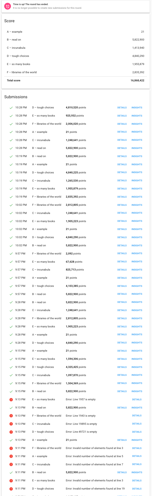

# ghc2020

# Extended run
## v13

Libraries random order

|                            | 10:47 AM        | 10:49 AM         | 10:50 AM        | 10:52 AM|
|-|-|-|-|-|
|A – example                 | 21              | 21               | 21              | 21|
|B – read on                 | 4,304,100       | 4,049,900        | 4,323,800       | 4,261,300|
|C – incunabula              | 886,856         | 860,164          | 818,122         | 882,561  |
|D – tough choices           | 4,378,725       | 4,393,675        | 4,378,985       | 4,383,275|
|E – so many books           | 633,920         | 908,746          | 896,323         | 858,111|
|F – libraries of the world  | 423,153         | 1,214,645        | 1,334,509       | 421,842 |

## v12

ritorno ad un solo potenziale e riparto da una soluzione semplice

|time|dset|points|
|--|--|--|
|10:15 AM | A – example |21 points|
|10:15 AM | B – read on |5,822,900 points|
|10:15 AM | C – incunabula |1,248,641 points|
|10:15 AM | D – tough choices |4,840,290 points|
|10:15 AM | E – so many books |1,367,491 points|
|10:15 AM | F – libraries of the world |2,656,507 points|
|Total | | 15,935,850 |

# Classification run

## v11

calcolo 2 volte il potenziale, la seconda considero che ogni libreria parte dopo quella che la precede

situazione prima dell'extended run: 

...   
...   
...   

## v7 

rimuovo i duplicati in reverse order di potenziale

## v6 

rimuovi duplicati in ordine di file

## v5

potenziale sul numero totale di libri

## v4 

potenziale sull amediana del valore dei libri

## v3

potenziale sulla media del valore dei libri

## v2

valore libreria == totale valore libri

## v1

reverse sort on books values for each libraries

## v0 

➜  ghc2020 git:(v0) ✗ go run main.go
file: a_example.txt, points: 21, max: 21, difference: 0
file: b_read_on.txt, points: 10000000, max: 10000000, difference: 0
file: f_libraries_of_the_world.txt, points: 39885586, max: 40111142, difference: 225556
file: e_so_many_books.txt, points: 12457261, max: 12548648, difference: 91387
file: c_incunabula.txt, points: 23372244, max: 30076415, difference: 6704171
file: d_tough_choices.txt, points: 5109000, max: 5109000, difference: 0
total, points: 90824112, max: 97845226, difference: 7021114, perc. missing: 7.175735%: 

2020/02/20 19:47:38 done in  707.653502ms

